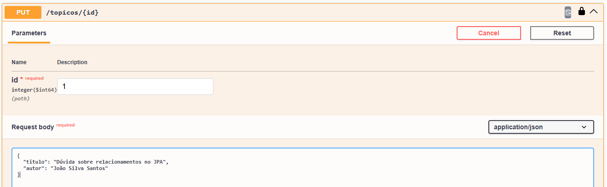
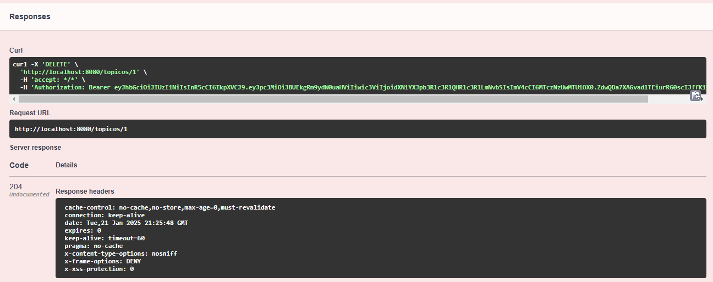

<p align="center">
	
</p>

O projeto **FórumHub** é uma API REST desenvolvida para simular o funcionamento de um fórum de discussão, permitindo aos usuários criarem, consultarem, atualizarem e deletarem tópicos. Realizado durante a formação Back-end da [Oracle Next Education (ONE)](https://www.oracle.com/br/education/oracle-next-education/), este desafio explora conceitos de arquitetura REST, autenticação/autorizacão e boas práticas de desenvolvimento.

## Índice

- [Pré-requisitos](#pré-requisitos)
- [Dependências](#dependências)
- [Funcionalidades](#funcionalidades)
- [Instalação](#instalação)
- [Como Usar](#como-usar)
- [Exemplo de Uso](#exemplo-de-uso)
- [Autora](#autora)
- [Licença](#licença)

---

### Pré-requisitos

- Java 17 ou superior
- Banco de dados MySQL
- IDE, sugestão: [IntelliJ IDEA](https://www.jetbrains.com/pt-br/idea/)

### Dependências

O projeto utiliza as seguintes dependências principais:

- **Spring Boot:** Framework utilizado para o desenvolvimento da API.
- **Flyway:** Para migrações de banco de dados. 
- **Spring Boot DevTools:** Para facilitar o desenvolvimento com recarregamento automático. 
- **Swagger:** Para documentação e testes da API.
- **MySQL:** Conector para o banco de dados MySQL.
- **Lombok:** Para simplificar a escrita de código (como getters, setters, construtores, etc). 
- **JWT (JSON Web Token):** Para a geração de tokens de autenticação. 
- **Spring Security Test:** Para auxiliar na realização de testes de segurança.

Essas dependências estão listadas no arquivo `pom.xml` do projeto.

### Funcionalidades

- Criar um novo tópico
- Listar todos os tópicos
- Consultar um tópico específico
- Atualizar um tópico
- Deletar um tópico

### Instalação

1. Clone o repositório para sua máquina local:

    ```bash
    git clone https://github.com/GessycaBorges/challenge-forum-hub-alura
    ```

2. Configure seu banco de dados MySQL, inserindo as variáveis de ambiente (pode substituir diretamente no arquivo application.properties):
    - `DB_HOST`, host.
    - `DB_NAME`, nome do banco de dados.
    - `DB_USER`, nome do seu usuário.
    - `DB_PASSWORD`, sua senha.

3. Crie o banco com o nome informado acima em `DB_NAME`.

4. Cadastre um usuário na tabela usuarios com login e senha criptografada com Bcrypt. Exemplo de query:

```sql
INSERT INTO usuarios (login, senha) VALUES ('usuarioteste@teste.com', '$2a$12$YwrUnWIQZBOFhsPA2N1LyOfirOjluer5goNgUjVvM3RyOWLHX7Exm');
```

### Como Usar
1. Execute o programa ForumhubApplication
2. A API estará disponível em http://localhost:8080
3. Utilize ferramentas como Postman ou Insomnia para realizar as requisições.
4. O projeto possui Spring Doc, permitindo que a API seja testada no Swagger em http://localhost:8080/swagger-ui.html.

### Exemplos de Uso

#### Realizar login

1. Para conseguir realizar as requisições é necessário realizar login na aplicação, onde será gerado um Bearer Token.

O fluxo de autenticação funciona da seguinte forma:
- Envie um POST para o endpoint /login com as credenciais (login e senha). 
- Se as credenciais forem válidas, o sistema retorna um Bearer Token que deverá ser usado nos cabeçalhos das requisições subsequentes.

Exemplo via Insomnia:
  

Exemplo via Swagger:
  
  

  
#### 1. Criar um novo tópico

Exemplo via Insomnia:


Exemplo via Swagger:


#### 2. Listar todos os tópicos

Exemplo via Insomnia:
  

Exemplo via Swagger:
  
  

#### 3. Consultar um tópico específico

Exemplo via Insomnia:
  

Exemplo via Swagger:
  
  

#### 4. Atualizar um tópico

Exemplo via Insomnia:
  

Exemplo via Swagger:
  
  

#### 5. Deletar um tópico

Exemplo via Insomnia:
  

Exemplo via Swagger:
  
  

### Autora

<a href="https://www.linkedin.com/in/gessycaborges/">
 <br />
 <sub><a>Gessyca Borges</a></sub></a> <a href="https://www.linkedin.com/in/gessycaborges/" title="Gessyca"></a>
 <br />

 ---

### Licença

Este projeto é de código aberto e pode ser utilizado livremente, sob a licença MIT.